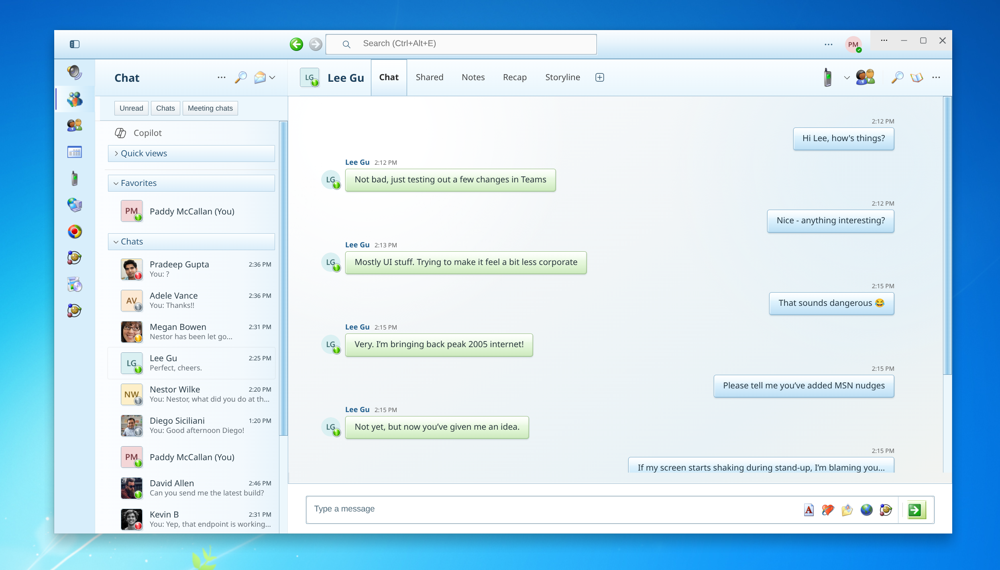
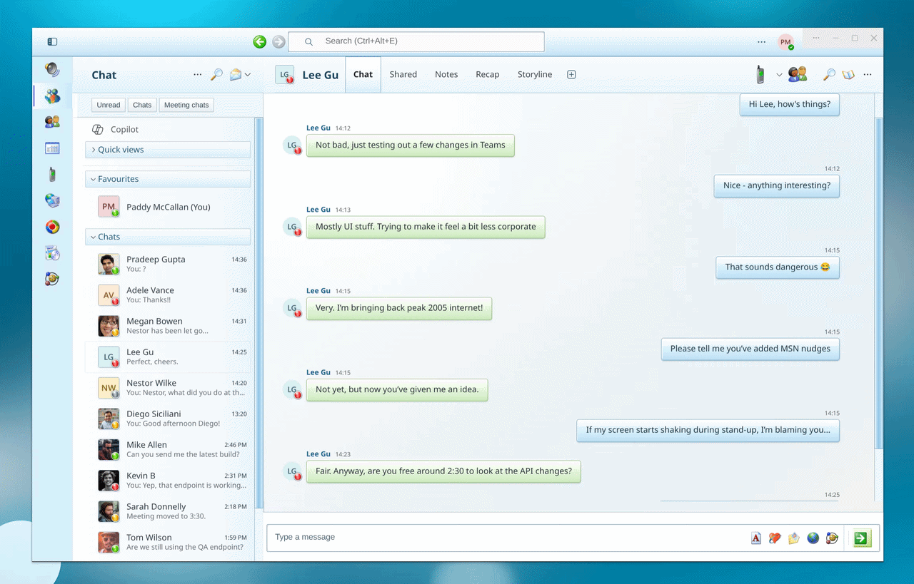
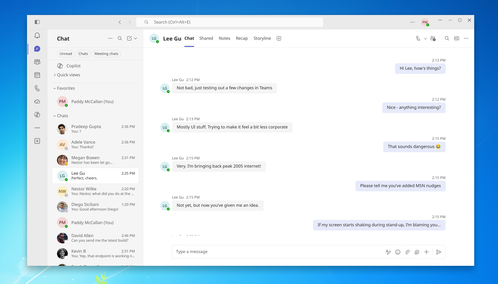
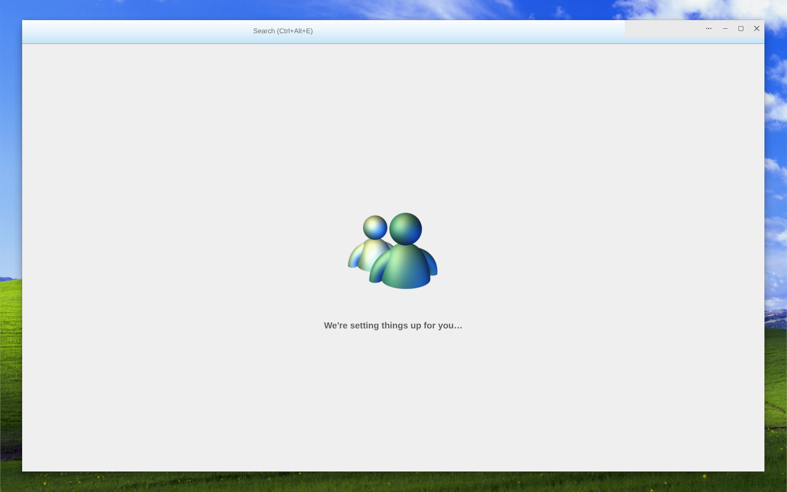

# Teams → MSN Messenger

A nostalgic Windows XP and Windows Live Messenger-inspired userstyle for the Microsoft Teams web app and PWA. It restyles Teams locally with glossy conversation bubbles, classic blue chrome, Windows-era icons, presence lamps, a redesigned composer, and a themed loading screen.

The style changes only what **you** see in your browser. It does not modify Teams, messages, accounts, or what other participants see.

[☕ Support development on Buy Me a Coffee](https://buymeacoffee.com/paddymac)

## Preview

### Teams with the MSN-inspired skin



### Animated before and after

[](screenshots/before_after_vid.webm)

▶ [Watch the higher-quality WebM comparison](screenshots/before_after_vid.webm)

### Standard Teams



### Themed loading screen



## Highlights

- Windows XP/Windows Live Messenger-inspired blue window chrome and navigation
- Glossy, colour-coded incoming and outgoing conversation bubbles
- Classic icon replacements for navigation, calls, participants and message actions
- Coloured presence lamps for available, busy, away and offline states
- Redesigned search, tabs, notifications and message composer
- Custom Teams loading artwork
- Separate scrollbar treatment for Chromium and Firefox
- Self-contained CSS with the required UI icons embedded as data URLs

## Requirements

- Microsoft Teams on the web or as a browser-installed PWA
- The [Stylus browser extension](https://github.com/openstyles/stylus)
  - [Chrome and Edge](https://chromewebstore.google.com/detail/stylus/clngdbkpkpeebahjckkjfobafhncgmne)
  - [Firefox](https://addons.mozilla.org/firefox/addon/styl-us/)

## Installation

1. Install Stylus in the same browser profile used by Teams.
2. Open [Microsoft Teams](https://teams.microsoft.com/) and sign in.
3. Select the Stylus toolbar icon, then choose **Write style for this URL**.
4. Give the style a name such as `Teams → MSN Messenger`.
5. Delete any starter CSS from the editor.
6. Copy the complete contents of [`style.css`](style.css) into the Stylus editor.
7. In **Applies to**, add both of these rules as **URLs beginning with**:

   ```text
   https://teams.microsoft.com/
   https://teams.cloud.microsoft/
   ```

8. Save the style and reload Teams. A hard refresh with `Ctrl+Shift+R` may be needed the first time.

> Do not configure the style to apply globally. It contains broad selectors and CSS variables intended specifically for Teams.

### Using it with the Teams PWA

Install Stylus in the browser profile from which the Teams PWA was installed. Ensure the extension is enabled for the Teams site, close the PWA completely, and reopen it after saving the style.

## Updating

When `style.css` changes:

1. Open the style from the Stylus manager.
2. Replace the existing CSS with the latest complete contents of `style.css`.
3. Save and refresh Teams.

The project currently uses plain CSS rather than the `.user.css` metadata format, so updates are manual.

## Browser notes

The closest visual match is currently in Chromium-based browsers such as Edge. Firefox supports solid scrollbar thumb and track colours through `scrollbar-color`, but it does not expose the same scrollbar parts used for the gradient, borders and hover treatment in Edge. The rest of the theme is intended to work in both engines.

## Troubleshooting

### The style does not appear

- Confirm Stylus is enabled for the current Teams domain.
- Check that both Teams URL rules are present.
- Save the style, then use `Ctrl+Shift+R` to refresh Teams.
- If using the PWA, close every Teams window before reopening it.

### Teams remains on its loading screen

Make sure you are using the latest complete `style.css`. Avoid adding global rules that disable or shorten animations: Teams uses an animation-completion event as part of removing its startup screen.

### An icon or layout suddenly looks wrong

Teams is updated frequently. This theme deliberately targets stable `data-tid`, `data-testid`, ARIA and role attributes instead of generated Fluent class names, but Microsoft may still rename or restructure elements. Open an issue with a screenshot and the relevant HTML copied from Developer Tools.

### Another extension changes the colours

Disable other userstyles, dark-mode extensions or page recolouring tools for Teams. They can override the theme's colour variables and backgrounds.

## Project files

- [`style.css`](style.css) — the complete Stylus stylesheet
- [`screenshots/`](screenshots/) — screenshots plus animated and video comparisons

The original icon-pack folders and generated working assets are intentionally excluded from Git. Required runtime images are embedded in `style.css`, so the ignored folders are not needed to use the theme.

## Privacy

Before adding screenshots or Developer Tools exports, check them for names, email addresses, tenant information, private messages and internal URLs. The local copied Teams HTML snapshot is ignored by default for this reason.

## Disclaimer and artwork

This is an unofficial fan-made userstyle and is not affiliated with, endorsed by, or supported by Microsoft. Microsoft Teams, Windows, Windows XP, MSN Messenger, their names, trademarks and associated artwork belong to their respective owners.

The embedded icon derivatives come from [marchmountain's Windows XP High Resolution Icon Pack](https://github.com/marchmountain/-Windows-XP-High-Resolution-Icon-Pack), which its creator released under [CC0 1.0 Universal](https://github.com/marchmountain/-Windows-XP-High-Resolution-Icon-Pack/blob/main/LICENSE). See [`THIRD_PARTY_NOTICES.md`](THIRD_PARTY_NOTICES.md) for attribution and rights information.

## Licence

Original CSS and project documentation are available under the [MIT License](LICENSE). The MIT License does not grant rights to Microsoft names, trademarks or product identities. Third-party artwork is covered by its respective terms as described in [`THIRD_PARTY_NOTICES.md`](THIRD_PARTY_NOTICES.md).

## Support development

If you enjoy the theme, you can [buy me a coffee](https://buymeacoffee.com/paddymac).

Contributions support ongoing CSS development and maintenance. They do not purchase or grant rights to Microsoft trademarks, icons, artwork or other third-party materials.

## Contributing

Selector fixes and visual improvements are welcome. When reporting a problem, include:

- Browser and version
- Teams web or PWA
- A cropped screenshot of the affected area
- The element's `data-tid`, `data-testid`, role or ARIA label where possible
